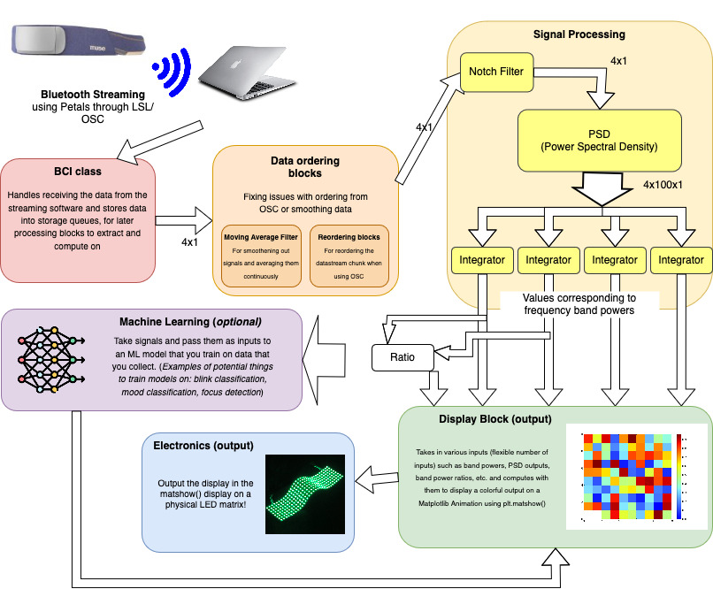

# EEG Mood Hat

# Introduction

The EEG Mood Hat is artistic EEG visualizer project that works with the Muse to stream, process, and visualize the user EEG data onto an RGB LED matrix! This project is a great way to learn all the essential skills for Neurotech software projects, and a open-ended project that lets you experiment and explore your creative side with neurotechnology!

The project has been split into several sections/phases, each of which you can realistically finish in one or two sessions (hyperlinked below). 

1. Phase 1: Connecting headsets and streaming data
2. Phase 2: Data processing and MNE
3. Phase 3: Machine Learning
4. Phase 4: Circuits
5. Phase 5: Integration and Experimentation

# Phase 1: Connecting Headsets and Streaming Data

## Setting Up Your Environment

To "submit" and push code for us and your peers to help with, you should push your code to a separate branch of the nmep_mood_hat remote repository. Have your full name in the branch name, as well as any additional information you wish (if you are making additional branches to temporarily test features). 

Instructions for installing miniconda can be found [here](https://docs.conda.io/projects/miniconda/en/latest/)
We would recommend installing miniconda from the command line, which can be found at the bottom of the page. Once downloaded and initialized, open a command line interface to manage environments. We'll follow the instructions on [this page](https://conda.io/projects/conda/en/latest/user-guide/tasks/manage-environments.html#activating-an-environment). Environments can be used to manage different versions of packages/python without interfering with other projects.

In order to create an environment, run the command "conda create --name [NAME]" where NAME is a name of your choosing. 
Once the environment has been created, activate it using the command "conda activate [NAME]". If activated properly, the environment name should be shown to the left of the command prompt.

Once the environment has been activated, we want to install python with "conda install python=3.9". If conda asks you "proceed ([y]/n)?", type y and press enter. 
Now that we have an environment with package managers, we want to install all the versions of the packages we want. These can be found in the requirements.txt file. To install everything, run "pip install -r requirements.txt". This should install everything needed for the project. 
To deactivate the environment, run "conda deactivate". Make sure to activate and deactivate the environment when you have started/finished your work to keep everything clean.

## Headset Information

The headset you will be using for the base version of this project is the Muse S Gen 2 (image below). 

Here are links to specifications to the Muse S, as well as some other helpful resources: 
- [Muse Product Comparison Page](https://choosemuse.my.site.com/s/article/Comparing-Muse-Headbands?language=en_US)
- [Muse S Gen 1 Technical Specification](https://images-na.ssl-images-amazon.com/images/I/71A9NwYDx9S.pdf) (should be mostly similar to the specifications of the Gen 2)
- [Muse S Product Page](https://choosemuse.com/products/muse-s-gen-2)
- [Using Muse: Rapid Mobile Assessment of Brain Performance (Paper)](https://www.frontiersin.org/articles/10.3389/fnins.2021.634147/full)

Here are the key bits of specification:
| Spec | Value |
| ----------- | ------------- |
| Wireless connection | BT 4.2 BTLE |
| EEG Channels | 4 EEG channels + 2 amplified Aux channels |
| | 256 Hz effective sample rate |
| | 12 bits/sample resolution |
| Reference electrode position | FPz (CMS/DRL) |
| Channel electrodes positions | TP9, AF7, AF8, TP10 (dry) |
| Accelerometer | Three-axis @ 52Hz, 16 bit resolution, range +/ - 4G |
| Gyroscope | +/- 1000 degrees per second |
| PPG sensor | IR/Red/Green, 64 samples/s, 16-bit resolution |
| Thermistor sensor | 12 bits/sample resolution, 16Hz sample rate |
| noise suppression | DRL – REF feedback with 2μV(RMS) noise floor |
| | No notch filter onboard |

The most important information is the EEG Channel information; we will be focusing on using streamed EEG data for the majority of the project, but you are free to stream and use data from the other sensors to extend your project in the final experimentation section! 

The Muse uses a BT 4.2 [BTLE](https://www.google.com/search?client=firefox-b-1-d&q=BTLE) connection to stream data to devices. You can hence connect the Muse to your iOS or Android devices for mobile applications, or connect to your laptops as we will do in this project. If you have an understanding of networking and wireless communications, you could create a tool to connect and directly stream information to your device, but for the sake of most projects we will use [Petals software](https://docs.petal.tech/).

### Connecting with Petals

1. Download Petals from the [NTAB Software Notion page](https://www.notion.so/Misc-7ec2f0f79bda45f4afaef6f5633877e6)

2. Follow the [instructions on this page](https://docs.petal.tech/connect-to-muse/connect-a-muse-device) to start Petals and connect the service with the Muse. USE OSL as your selected type.

3. Once petals is running and connected with the muse, open up the project codebase read src/osc_muse_stream.py. Run it by opening a terminal in VS Code, and writing the command python osc_muse_stream.py

4. With that you should see a message printing every second representing the datastream from the Muse headset! Nice work

### Troubleshooting

Sometimes Petal Metrics does not work with certain devices. If it doesn't and it is not a solvable issue, try doing the first phase of the project using muselsl and/or brainflow. Talk to other members or the leads if you want help trying this out. 

## Phase 2: Pipeline and Processing Blocks

_This section assumes you have an understanding of Python classes and [abstract classes](https://www.scaler.com/topics/abstract-class-in-python/)._

Pipelining is a data processing design in which data is passed through a series of blocks, each of which usually run some type of processing. In hardware design, parts of these blocks could be adders and multipliers. In software these could be reusable parts of processing code for different applications. 

In our project, we have three main types of classes of interest, and these can seen in the `BCI.py` file: `BCI`, `Pipe`, and `ProcessingBlock`.

**_BCI:_** This class is the first block of your pipeline. The BCI object is the first store/set of queues from which future blocks will receive data (see the "Multithreading" section below), and handles most of the handling with the Petals software and other streaming protocols to actually start streaming in data from your headset. You can take a look at the docstring for the class for more information about the class variables. 

**_Pipe:_** This class is the most fundamental "non-BCI" class, and essentially passes an identical copy of the data it receives to one or multiple processing blocks later in the pipeline (this will be very crucial for processing data in parallel and blocks that require multiple of the same output). 

_**ProcessingBlock:**_ An abstract class that serves as the template for all other processing blocks. It requires that all `ProcessingBlock` classes have an `__init__()` function, a `launch_server()` function that starts the block up to recieve and process data, and a `action()` function that actually does processing and is called by the `launch_server()` function. 

### Multithreading

Take a look at these videos and articles that explain multithreading:
- [(Article) Multithreading explained](https://www.techtarget.com/whatis/definition/multithreading)
- [(Video) Python Threading Library Explained in 8 Minutes](https://www.youtube.com/watch?v=A_Z1lgZLSNc)

Multithreading is used all over this project, and enables us to optimize a lot of the processing and to keep the output display rate as close as possible to "real time". As we can see above, the Muse S has a sampling rate of 256 Hz, which means it sends 256 samples every second. Your computer's CPU works at a **much** faster rate (what is the processing frequency of your laptop's CPU?), and hence there is a lot of work that could be done in between each sample. 

If we waited to recieve a sample, completed all the processing for that sample, and only _then_ looked for the next sample to process, we would waste a lot of time. In fact, we may actually spend more time than it would take to recieve the next sample. Many processing blocks also require a minimum number of samples before computing a value (e.g. averaging and PSD), which makes this waiting time even longer.

By using multithreading and queues, we can collect data while a block is held up computing on a particular set of samples, and make the processing done by different blocks independent of each other, which speeds up computation. 

Take a look at the `BCI.py` file, specifically the `BCI` and `Pipe` classes. You can see similar functions and behaviors as used in the Python Threading Library tutorial above, as well as the extensive usage of queues to handle the passing of data between different blocks. 

Questions to answer:

4. What is the default streaming protocol used in the `BCI` class? How does the `BCI` class switching between the two streaming protocols?
5. Queues are a data structure that follows FIFO - "First In First Out". Typically, the `deque` class is used when a queue data structure is required. What is special about the `Queue.queue` class that makes it useful for multithreading?
6. The `Pipe` class is an identity map: it takes samples and outputs the same samples. The `Pipe` class also has the option to take this input and send multiple copies to n sets of outupus, a "dimension 1 to dimension n" identity map. Why is this necessary for having data accessed by more than one block? Why can't the two blocks access the data directly by running `.get()` on the same input store? (Think about data races).

### Pipe Test

**Write a Python test file that uses the classes and functions in `BCI.py` to test the functionality of the `Pipe` class.** Create a set of 2 animations side-by-side using `matplotlib`, one showing the input data to the `Pipe` object, and the other showing the output of the `Pipe` instance. A successful `Pipe` and test file should have identical graphs, and should run pretty fast. **Include a GIF of this testbench working in your project documentation/report.**

**_Common errors_**:
- `Matplotlib`'s `animation.FuncAnimation` has an optional argument `interval` that determines the delay in milliseconds between each frame. This is set to 200ms by default, which would make your code _seem_ very slow. Decreasing this value (to the minimum viable number) will solve this problem.
- ChatGPT sometimes has meltdown understanding how to correct errors with `animation.FuncAnimation`. Look at documentation and examples online, these are often more reliable than wrestling with an LLM for an hour.

> [!NOTE]
> You should be writing test files like this to test the functionality of every processing block you write, and saving some result of a successful test, whether it be pictoral or GIF evidence, or CSVs/Python Notebooks of the resultant processed data. The latter set of evidence would make it much easier for your peers to help you. 

### `csvOutput` block

This is the first block that you will be implementing. In many situations, it will be useful to save the output of your pipeline into a CSV, which you can then read using Python or Jupyter Notebook to compare how your processing blocks compare against functions implemented in public libraries such as `mne`, `scipy`, and `numpy`. 

**Write a block `csvOutput` that takes incoming data and saves it into a single CSV. Make this agnostic of how many input channels there are, and how many inputs there are ** (if there are more than one block outputs that you want to save into the the CSV, your block should be able to handle it). You also may want to record your data for a very long time, and holding this data in a store in Python for very long time will be very memory intensive: **ensure that your block is adding data to the CSV continuously/in chunks over time, and not just all at once at the end.**

> [!NOTE]
> Each "block" should be written as a Python class. For computational blocks, use inheritance and inherit the `ProcessingBlock` template class (ask leads for help if any parts of the project are confusing). You should be implementing/re-implementing functions from the template class and adding any extra functions necessary. 

## Phase 3: Data processing and Pipeline

By this stage, you have finished your very own block! Great!

Right now, we can construct a decent pipeline to visualize data. This is great, but raw EEG without any computation isn't all that useful. There are all sorts of computation that you can do with EEG that are useful, from noise reduction, signal processing, machine learning and other algorithms, normalization, etc. 

Recall that in our real-time processing setup, we make use of blocks that each do a specific computation. Here are some blocks that would be useful for us:
- **Normalization:** this block would take in EEG data and compute the "z-score" for the data, a value that moves the mean of the data to 0 and quantizes it relative to the standard deviation of the data. (Note that there are many different ways of implementing this)
- **Averaging:** an easy way to get over noisy data is to using averaging! There are several types of averaging, the [Moving Average Filter](https://en.wikipedia.org/wiki/Moving_average) being one class of averaging.
- **Power Spectral Density:** this is a crucial block for computing the frequency domain information of the EEG data (a naturally time-series data).
- **Notch Filters:** Filters generally take signals and either filter out information in the time domain, or filter out frequencies in the frequency domain. A notch filter takes a specific frequency value and attenuates it (decreases amplitude), which is extremely useful for certain large and predictable sources of [noise](https://www.sfu.ca/~gotfrit/ZAP_Sept.3_99/h/hum_interference.html)!
- **Integration:** taking the integral for a range of data in the frequency domain is a very useful when calculating band powers, or powers of brainwave bands.

Below you can see a diagram of the various blocks of a barebones implementation of the mood hat project.

1. Data is streamed from the Muse S headset to you device, and the recieving of data is handled my a package, in this case Petal Metrics (other libraries used for this include pylsl, muselsl, Brainflow).
2. The `BCI` class object is used to collect the datastream from Petals into the first set of storage queues. This is where our pipeline begins. When using different headsets, this class has to be expanded and modified to work with new headsets.
3. Depending on the protocol you use or depending on how noisy your data is, you may want to include some initial processing blocks to clean your data before future steps.
  * For some streaming protocols like OSC, the data is sent in ordered chunks, but data in the chunks can be unordered. For this, we may want to implement an **Reordering Blocks** to take n samples and sort them before sending them to the next block. 
  * In some situations you may want to smoothen your data by using a **Moving Average Filter** which averages the current sample with values before and ahead of it.
4. Data is then passed into signal processing blocks (see Phase 4):
  * Data is first passed into **Filtering blocks**, e.g. the **Notch Filter** block. This runs computations on the signal that affects different frequencies in the signal, which is useful to remove noise.
  * Filtered data is them passed into a **Power Spectral Density** block, which takes in a time series data and outputs the frequency information in the data. This is what we will need to do most of our other computation.
  * We are usually interested in the relative power of groups of frequencies (frequency bands, e.g. alpha, beta, gamma, delta) instead of the power of an individual frequency when doing EEG analysis. Hence, we will take multiple frequency outputs from the PSD block and run them through an **Integrator** block that integrates the signals received.
  * Sometimes the ratio of two different frequency bands are useful for measuring states like focus, and hence we may compute some ratios using a **Ratio** block (takes two inputs and outputs the division of the two values).
5. All this information is fed into the **Display Block**. This does some computation on the inputs it receives (up to you to decide and be creative with!), and outputs a matrix plot to visualize the changing signals.
6. **Electronics:** This Display can be sent to an LED Matrix, a electronic component with a grid of RGB LEDs which can be programmed.

### Block: Averaging

**Task:** Implement a block for computing a "moving average". For each channel, your block will take in several samples of data, then send the data to the next block (still use the same system of queues and stores that the `Pipe` class used). 

This will have you implement a block that takes a signal and returns a signal that is the average of every x samples. 

**(Light) Challenge:** Try to implement a stronger and more useful version of the moving average which allows for overlap over the x samples used to calculate the average. Allowing for overlap allows for more samples to be outputted, and is better from a signals point of view (refer to EE120 and EE123 for more details on why). 

### Block: Reordering

With an OSC streaming protocol, the data is sent in bundles of multiple samples, however the data inside these bundles do not have to be ordered. This is a big problem for analyse as we depend on our data being ordered for signal analysis and noise reduction. 

**Task:** The Muse headset (and other headsets that use OSC and LSL streaming protocols) send a sample ID or timestamp. Design a block that takes both the data from the headset channels and the timestamps, waits for several samples and then sends this set of samples reordered. Note you can assume that this misordering only happens between samples pretty close to each other chronologically. IF you try ordering every 10-20 samples this should be suffficent. (suggestion: add the number of samples reordered as an optional parameter for your reordering block class).

## Phase 4: Signal Processing

### Block: Notch Filter

Power lines and power outlets operate at 60 Hz, which produces noise in our data. This noise can override the actual EEG data collected, but luckily the power of signal processing lets us counteract this!! This block will allow you to implement a filter on the data to remove 60 Hz noise. 

**Task:** Design a block that uses MNE(a library for working with neuromodalities like EEG) to implement a notch filter. This block should accept the data from the headset channels and the frequency you want to filter out(in this case 60 but make it variable), and output the same data but with 60 Hz noise filtered out. Here's the MNE notch filter documentation: https://mne.tools/1.8/generated/mne.filter.notch_filter.html

If you're interested in learning more about 60 Hz noise and why we bother filtering it: https://people.ece.cornell.edu/land/courses/ece4760/FinalProjects/s2008/rmo25_kdw24/rmo25_kdw24/index.html#:~:text=60%20Hz%20noise%20is%20frustrating,systems%20near%20an%20AC%20transformer.

### Block: Power Spectral Density(PSD)

Power spectral density is a way to visualize how powerful each frequency present in a signal is. 

More block descriptions coming soon!

## Phase 5: Display
To be Released! (I will write this up soon)

## Phase 6: Machine Learning
To be Released!

## Phase 7: Integration and Experimentation

You are almost at the end! Congrats!

### Phase 7.1: Reconstruct a Full EEG Mood Hat Pipeline

Now it is time to put everything together. Create a full pipeline that takes EEG data, has a moving average filter (optional), computes the PSD, calculates for the theta-beta band ratio correlating with attention, and using it to display a a visual where the amount of noise is controlled by the theta-beta ratio. If errors are found when testing remaining blocks in the pipeline, feel free to make changes and push them along with files that test for the correctness of the blocks.

Keep this demo in a separate script, and test your complete system!

### Phase 7.2: Project Extensions

Now is the fun part!

Each member should take up an extension method to make the project more complete as a whole. Choose from one of the following, allocating one task per person. 

Fix LSL Streaming

Tags: [networking]
  
Petals has a way to use LSL streaming with the device. Unfortunately, it's currently not working with the pipeline. By swithcing what streaming method is in the default initialization dictionary in BCI.py, you can select the LSL streaming function for the pipeline. 

LSL has a lot of benefits over OSC. For one, LSL orders incoming data and hence does not require to be reordered or averaged, which maintains the best streaming speed. 

- Test the LSL streaming, document the error and understand what the error outputs mean
- try to find ways to get LSL working.

 Add support for using OpenBCI 

Tags : [headsets, software pipeline, networking]

The pipeline currently depends on the Muse S for streaming and depends on Petos as a streaming software. It currently does not support any other headsets. However, we would like to enable the option to allow any headset to be used for this platform. 

Tasks:
- Make the arguments that are not necessary for every headset option in the initialization function for the `BCI` class.
- Show a working demo of the software pipeline working with the OpenBCI headset.

 Implement Welch's 

Tags : [Signal Processing]

The current method used to compute the PST is a naive method. Welch's method is a more robust method that more accurately computes the PST. This section of the project should learn what Welch's method is and implement a real-time computation method for Welch's method.

Tasks:
- Writeup on what Welch's method is, how it defers from this method, and how to compute Welch's metho
- Implement Welch's method in real time, adding the method as an optional argument for the PSD block. DO NOT call welch's method from another library.

 Blink Detection 

Tags : [preprocessing, machine learning]
 
Oftentimes, we want data to be normalized and we want to analyze EEG time series data or spectral data relative to samples from prior timestamps or prior sessions. To do this, we require normalization. 

Tasks:
- Write a block that takes in data (can be either frequency or time-series) and normalizes it to a zero-mean distribution. Have the true mean and true standard deviation passed along with the data to the next block. Have this be computed in real time with minimal delay. (hint: some of this might be implemented in `./tests/visual_test/visual_testbench.py`)

More extension ideas will be gradually added! Feel free to propose your own!

## Contributers
- Anurag Rao
- Reuben Thomas
